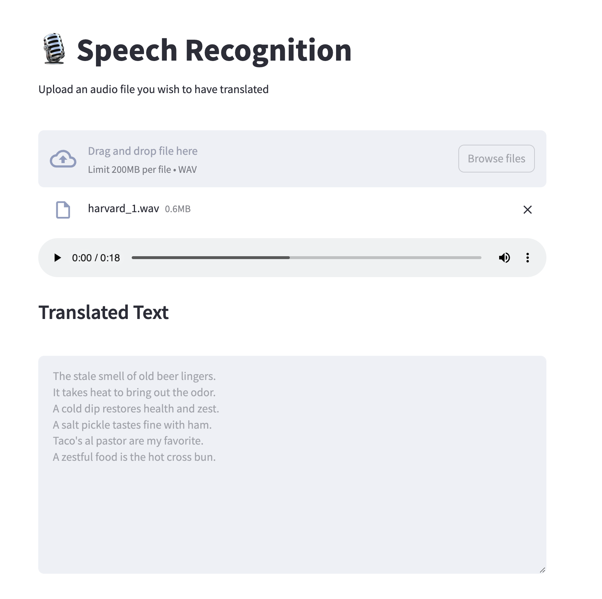

# Audio to Text Application

  This sample application is a simple recipe to transcribe an audio file.
  This provides a simple recipe to help developers start building out their own custom LLM enabled
  audio-to-text applications. It consists of two main components; the Model Service and the AI Application.

  There are a few options today for local Model Serving, but this recipe will use [`whisper-cpp`](https://github.com/ggerganov/whisper.cpp.git)
  and its included Model Service. There is a Containerfile provided that can be used to build this Model Service within the repo,
  [`model_servers/whispercpp/Containerfile`](/model_servers/whispercpp/Containerfile).

  Our AI Application will connect to our Model Service via it's API endpoint.

<p align="center">

</p>

# Build the Application

In order to build this application we will need a model, a Model Service and an AI Application.  

* [Download a model](#download-a-model)
* [Build the Model Service](#build-the-model-service)
* [Deploy the Model Service](#deploy-the-model-service)
* [Build the AI Application](#build-the-ai-application)
* [Deploy the AI Application](#deploy-the-ai-application)
* [Interact with the AI Application](#interact-with-the-ai-application)
    * [Input audio files](#input-audio-files)

### Download a model

If you are just getting started, we recommend using [ggerganov/whisper.cpp](https://huggingface.co/ggerganov/whisper.cpp).
This is a well performant model with an MIT license.
It's simple to download a pre-converted whisper model from [huggingface.co](https://huggingface.co)
here: https://huggingface.co/ggerganov/whisper.cpp. There are a number of options, but we recommend to start with `ggml-small.bin`. 

The recommended model can be downloaded using the code snippet below:

```bash
cd models
wget https://huggingface.co/ggerganov/whisper.cpp/resolve/main/ggml-small.bin 
cd ../
```

_A full list of supported open models is forthcoming._  


### Build the Model Service

The Model Service can be built from the root directory with the following code snippet:

```bash
cd model_servers/whispercpp
podman build -t whispercppserver .
```

### Deploy the Model Service

The local Model Service relies on a volume mount to the localhost to access the model files. You can start your local Model Service using the following podman command:  
```
podman run --rm -it \
        -p 8001:8001 \
        -v Local/path/to/locallm/models:/locallm/models \
        -e MODEL_PATH=models/<model-filename> \
        -e HOST=0.0.0.0 \
        -e PORT=8001 \
        whispercppserver
```

### Build the AI Application

Now that the Model Service is running we want to build and deploy our AI Application. Use the provided Containerfile to build the AI Application
image from the `audio-to-text/` directory.

```bash
cd audio-to-text
podman build -t audio-to-text . -f builds/Containerfile   
```
### Deploy the AI Application

Make sure the Model Service is up and running before starting this container image.
When starting the AI Application container image we need to direct it to the correct `MODEL_SERVICE_ENDPOINT`.
This could be any appropriately hosted Model Service (running locally or in the cloud) using a compatible API.
The following podman command can be used to run your AI Application:  

```bash
podman run --rm -it -p 8501:8501 -e MODEL_SERVICE_ENDPOINT=http://0.0.0.0:8001/inference audio-to-text 
```

### Interact with the AI Application

Once the streamlit application is up and running, you should be able to access it at `http://localhost:8501`.
From here, you can upload audio files from your local machine and translate the audio files as shown below.

By using this recipe and getting this starting point established,
users should now have an easier time customizing and building their own LLM enabled applications.   

#### Input audio files

Whisper.cpp requires as an input 16-bit WAV audio files.
To convert your input audio files to 16-bit WAV format you can use `ffmpeg` like this:

```bash
ffmpeg -i <input.mp3> -ar 16000 -ac 1 -c:a pcm_s16le <output.wav>
```
