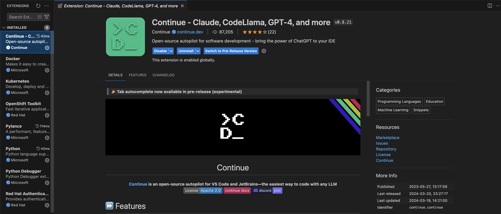
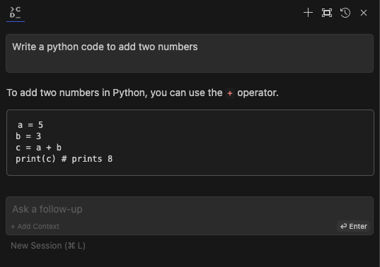
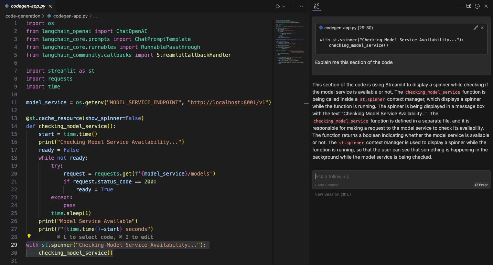
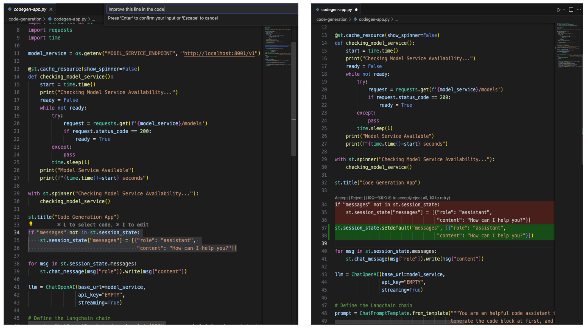

# Integrating Language Models with Visual Studio Code (VS Code)

In this guide, we'll walk through the process of integrating a language model with Visual Studio Code (VS Code) to enhance code generation tasks and developer productivity.

## Step 1: Install "Continue" Extension



To begin, install the "Continue" extension from the Visual Studio Code Marketplace. Open VS Code and navigate to the Extensions view by clicking on the square icon in the sidebar or pressing `Ctrl+Shift+X`. Search for the "Continue" extension and click on the "Install" button to install it.

## Step 2: Ensure Model Service is Running

Before configuring the "Continue" extension, ensure that the Model Service is up and running. Follow the instructions provided in the existing (README.md)[README.md] document to build and deploy the Model Service. Note the port and endpoint details for the Model Service.

## Step 3: Configure "Continue" config.json File

Once the Model Service is operational, configure the "Continue" extension. Open VS Code and access the Command Palette by pressing `Ctrl+Shift+P` (Windows/Linux) or `Cmd+Shift+P` (Mac). Type "Continue: Configure" and select the option to open the configuration file. Edit the `config.json` file with the appropriate configuration.

```
{
  "title": "YourTitleHere",
  "model": "YourModelName",
  "completionOptions": {},
  "apiBase": "http://localhost:8001/v1/",
  "provider": "openai"
}
```

## Step 4: Examples of Interaction

Now that you've configured the "Continue" extension, let's explore how you can effectively interact with the language model directly within VS Code. Here are several ways to engage with the extension:

1. **Code Autocompletion:** Open the "Continue" panel in VS Code and prompt the extension with a specific task, such as "Write a code to add two numbers." The extension will then provide relevant code autocompletion suggestions based on your input prompt, aiding in code generation and text completion tasks.

   

2. **Querying Working Code:** Copy your existing code snippet or press `⌘ + L` to paste it into the "Continue" panel, then pose a question such as "Explain this section of the code." The extension (LLM) will analyze the code snippet and provide explanations or insights to help you understand it better.

   

3. **Editing Code in Script:** Edit your Python code directly within a `.py` script file using the "Continue" extension. Press `⌘ + I` to initiate the edit mode. You can then refine a specific line of code or request enhancements to make it more efficient. The extension will suggest additional code by replacing your edited code and provide options for you to accept or reject the proposed changes.

   

By exploring these interactions, users can fully leverage the capabilities of language models within VS Code, enhancing their coding experience and productivity.

