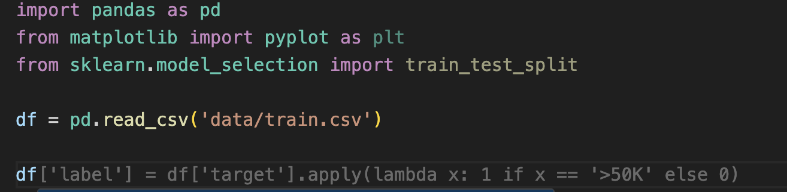

# Integrating Language Models with Visual Studio Code (VS Code)

In this guide, we'll walk through the process of integrating a language model with Visual Studio Code (VS Code) to enhance code generation tasks and developer productivity.

## Step 1: Install "Continue" Extension


To begin, install the "Continue" extension from the Visual Studio Code Marketplace. Open VS Code and navigate to the Extensions view by clicking on the square icon in the sidebar or pressing `Ctrl+Shift+X`. Search for the "Continue" extension and click on the "Install" button to install it.

## Step 2: Ensure Model Service is Running

Before configuring the "Continue" extension, ensure that the Model Service is up and running. Follow the instructions provided in the existing [README.md](README.md) document to build and deploy the Model Service. Note the port and endpoint details for the Model Service.

## Step 3: Configure "Continue" config.json File

Once the Model Service is operational, configure the "Continue" extension. Open VS Code and access the Command Palette by pressing `Ctrl+Shift+P` (Windows/Linux) or `Cmd+Shift+P` (Mac). Type "Continue: Configure" and select the option to open the configuration file. Edit the `config.json` file with the appropriate configuration.

```
{
  "title": "YourTitleHere",
  "model": "YourModelName",
  "completionOptions": {},
  "apiBase": "http://localhost:8001/v1/",
  "provider": "openai"
}
```

# Interacting with the "Continue" Extension: Practical Examples

Now that you've configured the "Continue" extension, let's explore how you can effectively interact with the language model directly within VS Code. Here are several ways to engage with the extension:

1. **Prompting for code generation:** Open the "Continue" panel in VS Code and prompt the extension with a specific task, such as "Write a code to add two numbers." The extension will then provide relevant code autocompletion suggestions based on your input prompt, aiding in code generation and text completion tasks.

   

2. **Querying Working Code:** Copy your existing code snippet or press `⌘ + L` to paste it into the "Continue" panel, then pose a question such as "Explain this section of the code." The extension (LLM) will analyze the code snippet and provide explanations or insights to help you understand it better.

   

3. **Editing Code in Script:** Edit your Python code directly within a `.py` script file using the "Continue" extension. Press `⌘ + I` to initiate the edit mode. You can then refine a specific line of code or request enhancements to make it more efficient. The extension will suggest additional code by replacing your edited code and provide options for you to accept or reject the proposed changes.

   

By exploring these interactions, users can fully leverage the capabilities of language models within VS Code, enhancing their coding experience and productivity.

4. **Tab Autocomplete:**



In addition to its core functionalities, the "Continue" extension offers a tab auto complete feature in its pre-release version. This feature enhances the coding experience by providing aut-complete suggestions tailored to your coding context within VS Code. To leverage this functionality with the custom model, follow these steps to configure the `config.json` file:

**Configure `tabAutoCompleteModel`:** Define the model settings within the `tabAutoCompleteModel` object in the `config.json` file. This includes specifying the title, provider name, model name, and API endpoint. We use the same API endpoint from Step 2.

```
{
    "tabAutocompleteModel": {
        "title": "Tab Autocomplete Model",
        "provider": "provider name",
        "model": "model name",
        "apiBase": "https://<endpoint>"
    },
    ...
}
```

**Adjust Configuration Parameters:** Customize the configuration parameters according to your preferences. For example, you can set options such as, `useCopyBuffer`, `useSuffix`, `maxPromptTokens`, `debounceDelay`, `prefixPercentage`, and `multilineCompletion`. 

```
  "tabAutocompleteOptions": {
    "useCopyBuffer": false,
    "useSuffix": false,
    "maxPromptTokens": 100,
    "debounceDelay": 4000,
    "prefixPercentage": 0.5,
    "multilineCompletions": "never"
  }
```
Here's why we chose these parameter values:

- We set maxPromptTokens to 100 to prioritize processing speed.

- The debounceDelay is adjusted to 4000 milliseconds to introduce a delay between consecutive requests. This delay helps prevent frequent crashes of the model caused by excessive requests in a short period, especially considering that the feature is still in its pre-release stage and actively being developed.

With these configurations in place, you'll be able to interact with the models for tab autocomplete effectively within VS Code. Make any necessary adjustments to the parameter values based on your system's capabilities.

By integrating tab autocomplete into your coding workflow, you can streamline code completion tasks and enhance productivity while working within VS Code.
