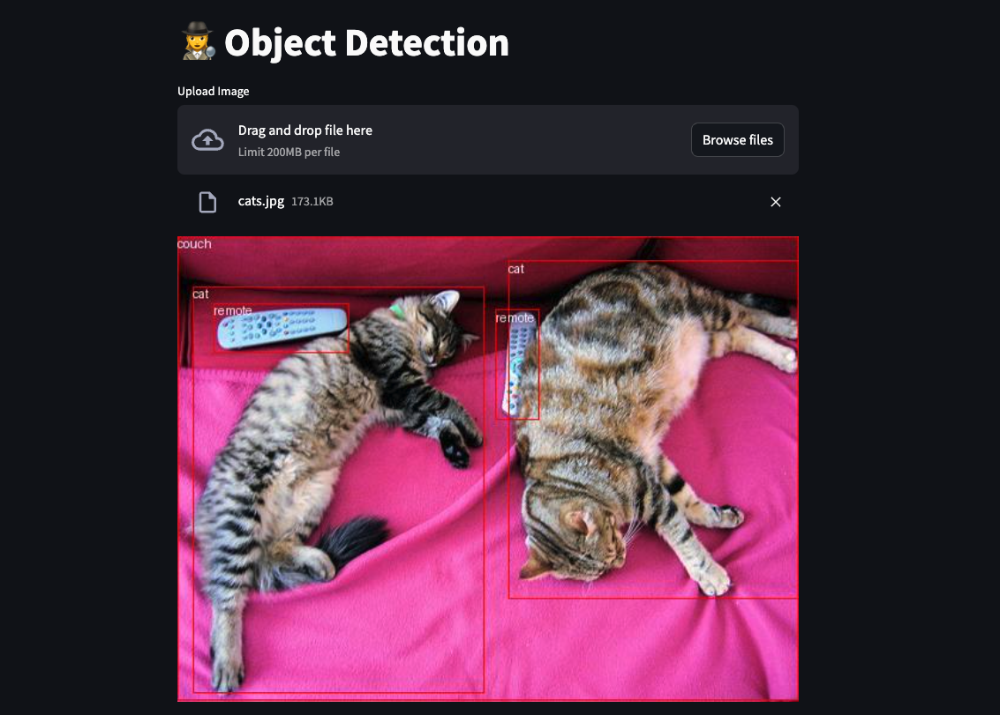

# Object Detection

This recipe provides an example for running an object detection model service and its associated client locally. 

## Build and run the model service

```bash
podman build -t object_detection_service object_detection/model_server 
```

```bash
podman run -it --rm -p 8000:8000 object_detection_service
```

By default the model service will use [`facebook/detr-resnet-101`](https://huggingface.co/facebook/detr-resnet-101), which has an apache-2.0 license. The model is relatively small, but it will be downloaded fresh each time the model server is started unless a local model is provided (see additional instructions below).  


## Use a different or local model

If you'd like to use a different model hosted on huggingface, simply use the environment variable `MODEL_PATH` and set it to the correct `org/model` path on [huggingface.co](https://huggingface.co/) when starting your container. 

If you'd like to download models locally so that they are not pulled each time the container restarts, you can use the following python snippet to a model to your `models/` directory.  

```python
from huggingface_hub import snapshot_download

snapshot_download(repo_id="facebook/detr-resnet-101",
                  revision="no_timm",
                local_dir="<PATH_TO>/locallm/models/vision/object_detection/facebook/detr-resnet-101",
                local_dir_use_symlinks=False)

```

When using a model other than the default, you will need to set the `MODEL_PATH` environment variable. Here is an example of running the model service with a local model:

```bash
 podman run -it --rm -p 8000:8000 -v <PATH/TO>/locallm/models/vision/:/locallm/models -e MODEL_PATH=models/object_detection/facebook/detr-resnet-50/ object_detection_service
```

## Build and run the client application

```bash
podman build -t object_detection_client object_detection/client 
```

```bash
podman run -p 8501:8501 -e MODEL_ENDPOINT=http://10.88.0.1:8000/detection object_detection_client
```

Once the client is up a running, you should be able to access it at `http://localhost:8501`. From here you can upload images from your local machine and detect objects in the image as shown below. 

<p align="center">

</p>


