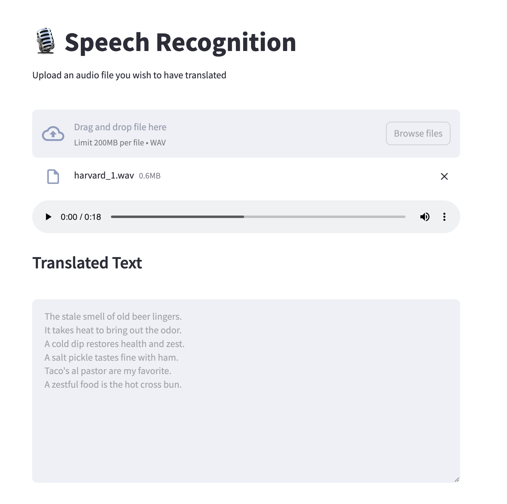

# Audio to Text Application

  This sample application is a simple recipe to transcribe an audio file.
  This provides a simple recipe to help developers start building out their own custom LLM enabled
  audio-to-text applications. It consists of two main components; the Model Service and the AI Application.

  There are a few options today for local Model Serving, but this recipe will use [`whisper-cpp`](https://github.com/ggerganov/whisper.cpp.git)
  and its included Model Service. There is a Containerfile provided that can be used to build this Model Service within the repo,
  [`model_servers/whispercpp/Containerfile`](/model_servers/whispercpp/Containerfile).

  Our AI Application will connect to our Model Service via it's API endpoint.

<p align="center">

</p>

# Build the Application

In order to build this application we will need a model, a Model Service and an AI Application.

* [Download a model](#download-a-model)
* [Build the Model Service](#build-the-model-service)
* [Deploy the Model Service](#deploy-the-model-service)
* [Build the AI Application](#build-the-ai-application)
* [Deploy the AI Application](#deploy-the-ai-application)
* [Interact with the AI Application](#interact-with-the-ai-application)
    * [Input audio files](#input-audio-files)

### Download a model

If you are just getting started, we recommend using [ggerganov/whisper.cpp](https://huggingface.co/ggerganov/whisper.cpp).
This is a well performant model with an MIT license.
It's simple to download a pre-converted whisper model from [huggingface.co](https://huggingface.co)
here: https://huggingface.co/ggerganov/whisper.cpp. There are a number of options, but we recommend to start with `ggml-small.bin`.

The recommended model can be downloaded using the code snippet below:

```bash
cd models
wget https://huggingface.co/ggerganov/whisper.cpp/resolve/main/ggml-small.bin
cd ../
```

_A full list of supported open models is forthcoming._


### Build the Model Service

The Model Service can be built from the root directory with the following code snippet:

```bash
cd model_servers/whispercpp
podman build -t whispercppserver .
```

### Deploy the Model Service

The local Model Service relies on a volume mount to the localhost to access the model files. You can start your local Model Service using the following Podman command:
```
podman run --rm -it \
	-p 8001:8001 \
	-v Local/path/to/locallm/models:/locallm/models \
	-e MODEL_PATH=models/<model-filename> \
	-e HOST=0.0.0.0 \
	-e PORT=8001 \
	whispercppserver
```

### Build the AI Application

Now that the Model Service is running we want to build and deploy our AI Application. Use the provided Containerfile to build the AI Application
image from the `audio-to-text/` directory.

```bash
cd audio-to-text
podman build -t audio-to-text app
```
### Deploy the AI Application

Make sure the Model Service is up and running before starting this container image.
When starting the AI Application container image we need to direct it to the correct `MODEL_ENDPOINT`.
This could be any appropriately hosted Model Service (running locally or in the cloud) using a compatible API.
The following Podman command can be used to run your AI Application:

```bash
podman run --rm -it -p 8501:8501 -e MODEL_ENDPOINT=http://0.0.0.0:8001/inference audio-to-text 
```

### Interact with the AI Application

Once the streamlit application is up and running, you should be able to access it at `http://localhost:8501`.
From here, you can upload audio files from your local machine and translate the audio files as shown below.

By using this recipe and getting this starting point established,
users should now have an easier time customizing and building their own LLM enabled applications.

#### Input audio files

Whisper.cpp requires as an input 16-bit WAV audio files.
To convert your input audio files to 16-bit WAV format you can use `ffmpeg` like this:

```bash
ffmpeg -i <input.mp3> -ar 16000 -ac 1 -c:a pcm_s16le <output.wav>
```

### Deploy the AI Application

Make sure the Model Service is up and running before starting this container image. When starting the AI Application container image we need to direct it to the correct `MODEL_SERVICE_ENDPOINT`. This could be any appropriately hosted Model Service (running locally or in the cloud) using an OpenAI compatible API. In our case the Model Service is running inside the Podman machine so we need to provide it with the appropriate address `10.88.0.1`. The following Podman command can be used to run your AI Application:

```bash
podman run --rm -it -p 8501:8501 -e MODEL_SERVICE_ENDPOINT=http://10.88.0.1:8001/v1 codegen
```

### Interact with the AI Application

Everything should now be up an running with the chat application available at [`http://localhost:8501`](http://localhost:8501). By using this recipe and getting this starting point established, users should now have an easier time customizing and building their own LLM enabled code generation applications.

_Note: Future recipes will demonstrate integration between locally hosted LLM's and developer productivity tools like VSCode._

### Embed the AI Application in a Bootable Container Image

To build a bootable container image that includes this sample chatbot workload as a service that starts when a system is booted, cd into this folder
and run:


```
make BOOTC_IMAGE=quay.io/your/codegen-bootc:latest bootc
```

Substituting the bootc/Containerfile FROM command is simple using the Makefile FROM option.

```
make FROM=registry.redhat.io/rhel9-beta/rhel-bootc:9.4 BOOTC_IMAGE=quay.io/your/codegen-bootc:latest bootc
```

The magic happens when you have a bootc enabled system running. If you do, and you'd like to update the operating system to the OS you just built
with the codegen application, it's as simple as ssh-ing into the bootc system and running:

```
bootc switch quay.io/your/codegen-bootc:latest
```

Upon a reboot, you'll see that the codegen service is running on the system.

Check on the service with

```
ssh user@bootc-system-ip
sudo systemctl status codegen
```

#### What are bootable containers?

What's a [bootable OCI container](https://containers.github.io/bootc/) and what's it got to do with AI?

That's a good question! We think it's a good idea to embed AI workloads (or any workload!) into bootable images at _build time_ rather than
at _runtime_. This extends the benefits, such as portability and predictability, that containerizing applications provides to the operating system.
Bootable OCI images bake exactly what you need to run your workloads into the operating system at build time by using your favorite containerization
tools. Might I suggest [podman](https://podman.io/)?

Once installed, a bootc enabled system can be updated by providing an updated bootable OCI image from any OCI
image registry with a single `bootc` command. This works especially well for fleets of devices that have fixed workloads - think
factories or appliances. Who doesn't want to add a little AI to their appliance, am I right?

Bootable images lend toward immutable operating systems, and the more immutable an operating system is, the less that can go wrong at runtime!

##### Creating bootable disk images

You can convert a bootc image to a bootable disk image using the
[quay.io/centos-bootc/bootc-image-builder](https://github.com/osbuild/bootc-image-builder) container image.

This container image allows you to build and deploy [multiple disk image types](../../common/README_bootc_image_builder.md) from bootc container images.

Default image types can be set via the DISK_TYPE Makefile variable.

`make bootc-image-builder DISK_TYPE=ami`

### Makefile variables

There are several [Makefile variables](../../common/README.md) defined within each `recipe` Makefile which can be
used to override defaults for a variety of make targets.
