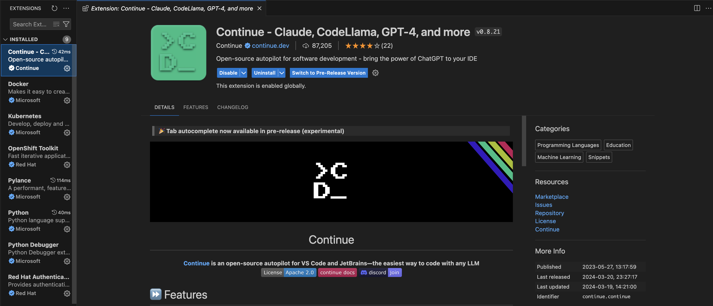

# Integrating Language Models with Visual Studio Code (VS Code)

In this guide, we'll walk through the process of integrating a language model with Visual Studio Code (VS Code) to enhance code generation tasks and developer productivity.

## Step 1: Install "Continue" Extension



To begin, install the "Continue" extension from the Visual Studio Code Marketplace. Open VS Code and navigate to the Extensions view by clicking on the square icon in the sidebar or pressing `Ctrl+Shift+X`. Search for the "Continue" extension and click on the "Install" button to install it.

## Step 2: Ensure Model Service is Running

Before configuring the "Continue" extension, ensure that the Model Service is up and running. Follow the instructions provided in the existing [README.md](README.md) document to build and deploy the Model Service. Note the port and endpoint details for the Model Service.

## Step 3: Configure "Continue" config.json File

Once the Model Service is operational, configure the "Continue" extension. Open VS Code and access the Command Palette by pressing `Ctrl+Shift+P` (Windows/Linux) or `Cmd+Shift+P` (Mac). Type "Continue: Configure" and select the option to open the configuration file. Edit the `config.json` file with the appropriate configuration.

```
{
  "title": "YourTitleHere",
  "model": "YourModelName",
  "completionOptions": {},
  "apiBase": "http://localhost:8001/v1/",
  "provider": "openai"
}
```

In addition to its core functionalities, the "Continue" extension offers a tab auto complete feature in its pre-release version. This feature enhances the coding experience by providing auto-complete suggestions tailored to your coding context within VS Code. To leverage this functionality with the custom model, follow these steps to configure the `config.json` file:

**Configure `tabAutoCompleteModel`:** Define the model settings within the `tabAutoCompleteModel` object in the `config.json` file. This includes specifying the title, provider name, model name, and API endpoint. We use the same API endpoint from Step 2.

```
{
    "tabAutocompleteModel": {
        "title": "Tab Autocomplete Model",
        "provider": "provider name",
        "model": "model name",
        "apiBase": "https://<endpoint>"
    },
    ...
}
```

**Adjust Configuration Parameters:** Customize the configuration parameters according to your preferences. For example, you can set options such as, `useCopyBuffer`, `useSuffix`, `maxPromptTokens`, `debounceDelay`, `prefixPercentage`, and `multilineCompletion`. 

```
  "tabAutocompleteOptions": {
    "useCopyBuffer": false,
    "useSuffix": false,
    "maxPromptTokens": 100,
    "debounceDelay": 4000,
    "prefixPercentage": 0.5,
    "multilineCompletions": "never"
  }
```

With these configurations in place, you'll be able to interact with the models for tab autocomplete effectively within VS Code. Make any necessary adjustments to the parameter values based on your system's capabilities.

By integrating tab autocomplete into your coding workflow, you can streamline code completion tasks and enhance productivity while working within VS Code.
